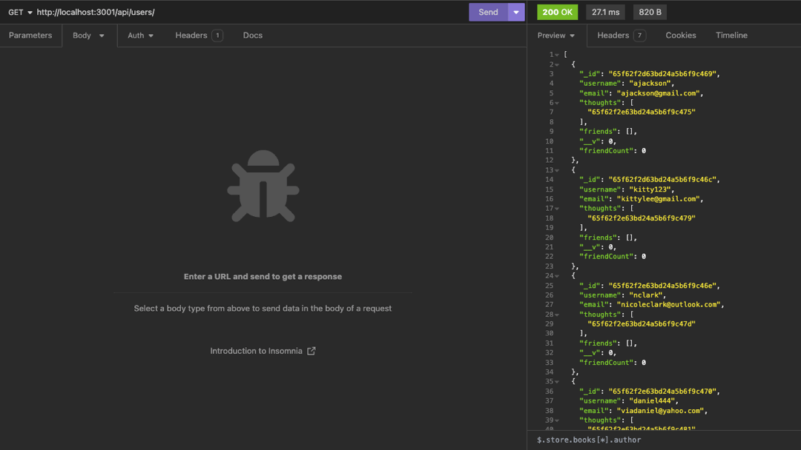
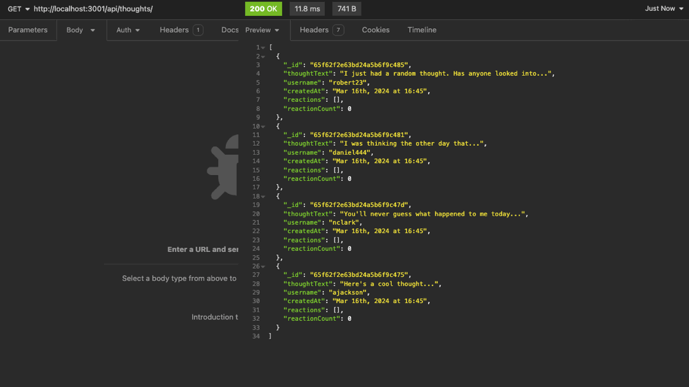

# NoSql Social Network API

## Description 
MongoDB is a popular choice for many social networks due to its speed with large amounts of data and flexibility with unstructured data. The goal of this project is to build an API for a social network web application where users can share their thoughts, react to friends’ thoughts, and create a friend list.

This application utilizes Express.js for routing, a MongoDB database, and the Mongoose ODM.

## Table of Contents 
- [Walkthrough Video](#walkthrough-video)
- [Installation](#installation)
- [Dependencies](#dependencies)
- [Usage](#usage)
- [Testing](#testing)
- [Contributing](#contributing)
- [License](#license)
- [Questions](#questions)
  
## Walkthrough Video 
Click on the following link to view a walkthrough video that highlights the usage of the appliation:
[NoSql Social Network API]()

## Installation 
Refer to the documentation in the [MongoDB](https://www.mongodb.com/docs/manual/installation/) website for guidance on installing and setting up MongoDB. 

Use the following steps to run the application locally:
1. Clone this repository to your local machine. (For reference, visit the [Cloning a Repository](https://docs.github.com/en/repositories/creating-and-managing-repositories/cloning-a-repository) GitHub Docs article.)
2. Run `npm i` in your CLI to download the npm package dependencies.
3. Optional: Run `npm run seed` to seed the database with the provided seed data.
4. Run `npm run start` to sync the Mongoose models to the MongoDB database and start the server.
  
## Dependencies
This project requires the following npm package dependencies:
1. [dayjs](https://day.js.org/)
2. [express](https://www.npmjs.com/package/express)
3. [jest](https://www.npmjs.com/package/jest)
4. [mongoose](https://www.npmjs.com/package/mongoose)

## Usage 

### User API Routes
The animation gif below shows the responses for the `User` API routes.  
  

Supported API: 
- `getUsers`: returns all the existing User documents in the collection 
- `getUserById`: returns a single User document by id 
- `createUser`: creates an instance of the User model using the data in req.body 
- `updateUser`: updates an existing User with the req.body
- `deleteUser`: deletes an existing User from the collection and deletes their associated Thoughts
- `addFriend`: add a new friend to a user's friend list
- `deleteFriend`: remove a friend from a user's friend list

### Thought API Routes
The animation gif below shows the responses for the `Thought` API routes.  
  

Supported API: 
- `getThoughts`: returns all existing Thought documents in the collection 
- `getThoughtById`: returns a single Thought document by id 
- `createThought`: creates an instance of the Thought model using the data in req.body 
- `updateThought`: updates an existing Thought with the req.body
- `deleteThought`: deletes an existing Thought from the collection
- `addReaction`: creates an instance of the Reaction schema to the associated Thought 
- `deleteReaction`: deletes an existing reaction subdocument from the associated Thought

## Testing 
A testing suite was written with [jest](https://www.npmjs.com/package/jest) for the helper function `format_date`. You may execute the test suite by running `npm run test` on the CLI.  
The API routes were tested locally during development with the [Insomnia](https://docs.insomnia.rest/) development platform.  
Please refer to the [Installation](#installation) section if you are interested in running and testing the application locally.

## Contributing
To make contributions to this project:  
1. Fork the repository  
2. Make some commits to improve the application
3. Open a Pull Request on GitHub
4. From there, we can discuss your changes and merge the pull request once your contributions have been approved!

## License 
This GitHub repository is licensed under the MIT license. Please refer to the license documentation [here](https://opensource.org/licenses/MIT).
  
## Questions
This project was developed by [dymoy](https://github.com/dymoy).  
For any related questions, please contact me via email at <derekymoy@gmail.com>.
